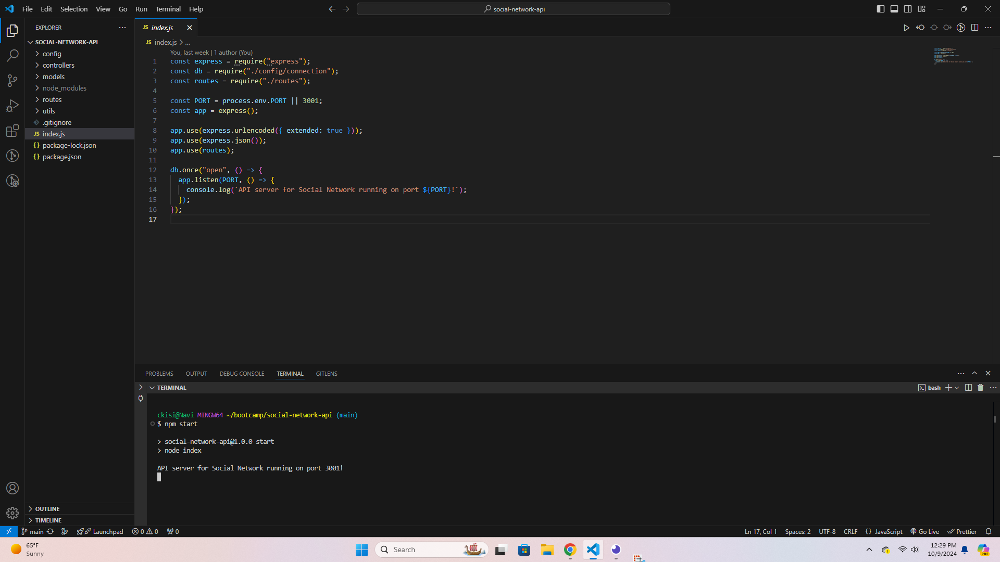
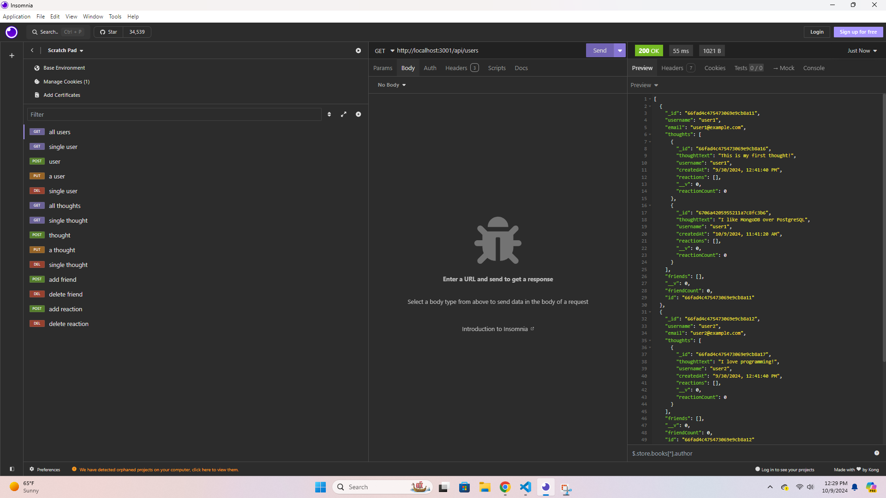
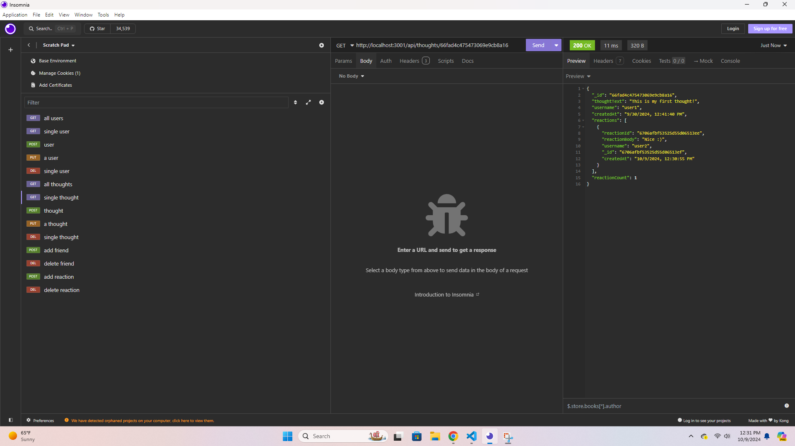

# Social Network API

## Description
This is an API for a Social Network app. It's meant to be implemented with a front end to create a full social media website. It includes all of the basics for a social network backend. It uses NoSQL structure with MongoDB, so it can handle large amounts of unstructured data. The database has users, thoughts (posts), and reactions (comments).

## Usage
Download, install with `npm i`, and start the server with `npm start`. It can read, create, update, and delete a user. It can also read, post, update, and delete a thought. It also has a friends feature where you can add a user to other users as their friend. There are comments on thoughts called "reactions", which allow users to comment on other user's thoughts.

## Technologies
- Node.js
- Express
- MongoDB

## Screenshots

## Links
- https://github.com/ckisi/social-network-api
- https://drive.google.com/file/d/1Xl4evyFZZ_OZ9LD8LxK4WnTsbLPZGzue/view

## Credits
Xpert Learning Assistant
